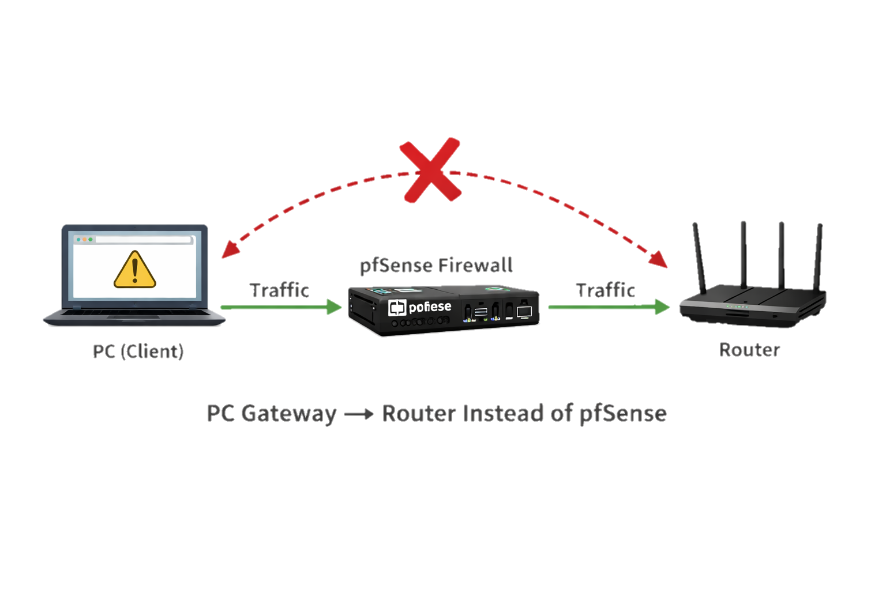

# pfSense DNS issue with Captive Portal not redirecting


## The problem:

The Captive Portal login page in pfSense does not appear on client devices.


No automatic redirect when opening a browser
curl does not return a redirect response


## root cause

Captive Portal It depends on the traffic passing through pfsense It is intercepted, but if The client device is not properly using pfSense as the network gateway and DNS server:


• Default Gateway is set to the router         instead of pfSense


• DNS server is pointing to the router (or     external DNS) instead of pfSense


As a result, traffic does not pass through pfSense correctly, so the Captive Portal is never triggered.


## the solution:

The client is using the router instead of pfSense as both the default gateway and DNS server.





## Practical Fix (windows):

Press Windows + R
Type:

``` control ```


Go to:

Network and Sharing Center


Change adapter settings


Right-click your active network adapter → Properties


Select:

Internet Protocol Version 4 (IPv4) → Click Properties

Choose:


Use the following IP address
Set:


Default Gateway = pfSense IP (e.g. 192.168.1.1)


Preferred DNS Server = pfSense IP


